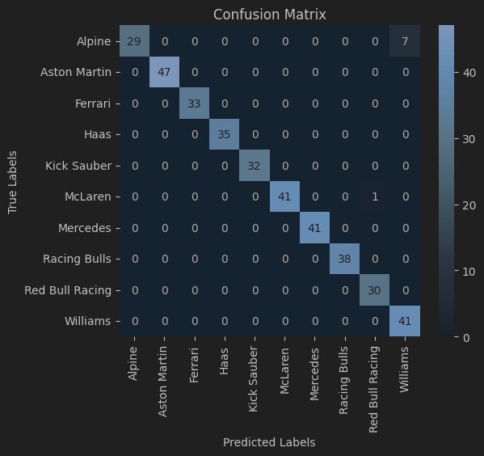

# PRZED URUCHOMIENIEM PROJEKTU

Dane wykorzystane do uczenia modeli muszą być prawidłowo przygotowane - do tego służą pliki *create_dataset.ipynb* oraz *result_prediction_data_prep.ipynb*. 

Pierwszy z nich generuje syntetyczny zbiór danych służący do nauczenia sieci neuronowej, wykorzystanej do rozpoznawania obrazu, a drugi przygotowuje dane (szczegóły w sekcji "[Dane](#Dane)") do uczenia modelu regresji logistycznej, wykorzystanej do przewidywania wyniku mistrzostw. 

Oba te pliki muszą zostać uruchomione przed przystąpieniem do uczenia modeli.

# Raport z projektu o Formule 1  
  
06-DUMAUI0 2024/SZ  
  
Autor: *Wojciech Grzybowski*  
  
## Cel projektu  
Celem projektu było stworzenie dwóch modeli:  
  
1. Przewiduje nazwę zespołu na podstawie zdjęcia logo (sieci neuronowe),  
2. Przewiduje wygranie mistrzostwa (wartość 0/1) w sezonie na podstawie następujących cech:  
    1. Średnia pozycja końcowa w wyścigu w sezonie,  
    2. Średnia pozycja końcowa w kwalifikacjach w sezonie,  
    3. % zwycięstw w sezonie względem liczby wyścigów,  
    4. % przejechanych okrążeń względem wszystkich możliwych  
  
Dla cechy 1. należy wykorzystać stosunek zwycięstw do liczby wyścigów, ponieważ sezony mogą mieć różną liczbę wyścigów, co naturalnie implikuje tą samą zależność dla cechy 2.  
  
## Dane  
Dane dla problemu 1. pochodzą ze strony Google Grafika (logo każdego zespołu). Z pierwotnych zdjęć utworzono sztuczny zbiór, generując duplikaty oryginalnego logo, które mają nałożony losowy obrót od 0 do 360 stopni. W ten sposób utworzony został zbiór mający 2500 przykładów (250 zdjęć dla każdego z 10 zespołów), zatem zbiór uczący składa się z 1750 obrazów, a zbiór testowy z 750 obrazów.
  
Dane dla problemu 2. pochodzą ze strony kaggle.com: https://www.kaggle.com/datasets/cjgdev/formula-1-race-data-19502017  
  
Aby przygotować dane do uczenia dla problemu 2. należało:  
1. Odrzucić kolumny, które nie wnoszą wartościowych informacji (takich jak numer kierowcy, liczba punktów, czas wyścigu itd.),  
2. Pliki *races* oraz *results* należało połączyć za pomocą kolumny *raceId*, aby określić, z którego roku pochodzi dany rezultat. W ten sposób można policzyć wszystkie statystyki w każdym z sezonów osobno, ponieważ kierowcy mogą brać udział w więcej niż jednym sezonie. Za pomocą pętli for, która inkrementuje od 1950 do 2018, wybieram tylko te wiersze, które wartość *year* mają równą ze zmienną sterującą, aby brać pod uwagę wyniki tylko z jednego sezonu.  
3. Zliczenie średniej z pozycji na starcie oraz pozycji na mecie, a następnie pogrupowanie tych wyników według unikalnego id kierowcy *driverId*,  
6. Aby zliczyć % zwycięstw w sezonie, należało zliczyć wszystkie wyścigi w sezonie na podstawie kolumny *year*. Następnie, dla każdego kierowcy (*driverId*) zsumować kolumnę *positionOrder* w danym sezonie, jeżeli wartość wiersza = 1 (1. miejsce na mecie - zwycięstwo w wyścigu). Taką sumę dzielę przez liczbę wyścigów i otrzymuję % zwycięstw w sezonie dla każdego kierowcy.  
7. Aby zliczyć % przejechanych okrążeń w sezonie, należało zliczyć wszystkie okrążenia znajdujące się w pliku *lapTimes* dla każdego kierowcy. Liczba okrążeń składająca się na cały wyścig niestety nie jest przechowywana w pliku *races*, dlatego zakładamy, że całkowita liczba okrążeń w wyścigu to wartość funkcji max z wszystkich zarejestrowanych okrążeń dla danego wyścigu - w całej historii Formuły 1 nigdy nie zdarzyło się, aby nikt nie ukończył wyścigu, dlatego to założenie jest prawidłowe (najmniejsza liczba kierowców, która ukończyła wyścig F1 - 3: GP Monako w 1996 roku).  
  
Kompletny zbiór danych przygotowanych do uczenia składa się z 3059 wierszy. Jednak dopiero od sezonu 1996 wprowadzono zapis pomiaru każdego okrążenia, co jest kluczowe do obliczania procentu przejechanych okrążeń w sezonie. Po usunięciu wartości NaN (czyli rezultaty z sezonów 1950-1995), liczba wierszy to 540, a po podziale na zbiór uczący i testowy mamy 432 wiersze w zbiorze uczącym i 108 w zbiorze testowym.
  
## Modele  
W projekcie zastosowano 4 modele:  
1. Rozpoznawanie obrazu  
    1. sieci neuronowe - różne konfiguracje warstw  
2. Przewidywanie wyniku mistrzostw na podstawie 4 cech  
    1. regresja logistyczna - z regularyzacją oraz bez  
      

<div style="page-break-after: always;"></div>

### Rozpoznawanie obrazu  
  
Dla problemu rozpoznawania obrazu zastosowano 2 modele sieci neuronowych - jeden prostszy, a drugi bardziej złożony, składający się z większej ilości warstw konwolucyjnych. Modele prezentują się następująco:  
  
```python  
def create_simple_model():    
    model = Sequential([    
        Conv2D(32, (3, 3), activation='relu', input_shape=(250, 250, 3)),    
        MaxPooling2D((2, 2)),    
        Conv2D(32, (3, 3), activation='relu'),    
        MaxPooling2D((2, 2)),    
        Flatten(),    
        Dense(128, activation='relu'),    
        Dropout(0.5),    
        Dense(number_of_classes, activation='softmax')  
    ])        
    model.compile(loss=CategoricalCrossentropy(), optimizer="adam")  
          return model    
    
def create_advanced_model():    
    model = Sequential([    
    Conv2D(32, (3, 3), activation='relu', input_shape=(250, 250, 3)),    
    MaxPooling2D((2, 2)),    
    Conv2D(64, (3, 3), activation='relu'),    
    MaxPooling2D((2, 2)),    
    Conv2D(128, (3, 3), activation='relu'),    
    MaxPooling2D((2, 2)),    
    Flatten(),    
    Dense(256, activation='relu'),    
    Dropout(0.5),    
    Dense(number_of_classes, activation='softmax')    
    ])    
        
    model.compile(loss=CategoricalCrossentropy(), optimizer="adam")  
          return model  
```  
  
### Przewidywanie wyniku  
  
Dla problemu przewidywania wyniku zastosowano regresję logistyczną w dwóch wersjach - z regularyzacją oraz bez. Wykorzystano regularyzację L2 z parametrem $\lambda = 0.1$   
  
## Ewaluacje  
  
Do ewaluacji wykorzystano metryki *accuracy, precision, recall* oraz *F-score*.  
  
### Rozpoznawanie obrazu  
  
Dla wielkości wsadu 32 oraz dla 3 epok, otrzymano następujące rezultaty:  
  
| **Model**                  | **Accuracy** | **Precision** | **Recall** | **F-score** |
| -------------------------- | ------------ | ------------- | ---------- | ----------- |
| Prosta sieć neuronowa      | 0.9147       | 0.9879        | 0.8747     | 0.9278      |
| Rozbudowana sieć neuronowa | 0.9813       | 0.9813        | 0.9813     | 0.9813      |
  
### Przewidywanie wyniku  

| Model                                   | Accuracy | Precision | Recall | F-score |
| --------------------------------------- | -------- | --------- | ------ | ------- |
| Regresja logistyczna                    | 0.9722   | 0.75      | 0.6    | 0.6667  |
| Regresja logistyczna z regularyzacją L2 | 0.9815   | 1.0       | 0.6    | 0.75    |
  
## Wnioski  
  
### Rozpoznawanie obrazu  
  
Dla rozpoznawania obrazu, zastosowanie bardziej rozbudowanego modelu pozwoliło na zwiększenie dokładności przy tej samej liczbie epok, kosztem dłuższego czasu uczenia. Dla tak prostego zbioru danych (niezbyt złożona grafika na białym tle), lepiej wybrać pierwszy model i zwiększyć liczbę epok.  
  
Co ciekawe, podczas dostosowywania modelu, dla pewnej konfiguracji, _confusion matrix_ wyglądało następująco:   
  
Praktycznie wszystkie zespoły były "odgadywane" prawidłowo, oprócz zespołu Alpine - ten potrafił być mylony z zespołem Williamsa. Spójrzmy na loga obu tych zespołów:  
  
  
  
Oba z nich mają niebieski kolor oraz ostre kąty, co tłumaczy pomyłki modelu dla tych dwóch zespołów. Po zastosowaniu poprawek co do definicji modelu, wyżej opisane mylenie zanikło.

### Przewidywanie wyniku

Dla obu modeli, dokładność jest dosyć wysoka, a zastosowanie regularyzacji nie ma większego wpływu na rezultaty ewaluacji. Jest to prawdopodobnie spowodowane tym, że znaczna część wierszy w zbiorze uczącym ma wartość równą 0 dla kolumny oznaczającej, czy dany wynik w sezonie oznaczał zdobycie mistrzostwa. Tylko 22 wiersze z wszystkich 540 miały tą wartość równą 1 (tylko jeden kierowca w sezonie może zdobyć mistrzostwo, co implikuje, że mamy w zbiorze 22 sezony - co jest prawdą, gdyż w zbiorze zawarte są sezony 1996-2018). Przez to, model niechętnie przydzielał wartość 1 dla tej kolumny - znacząca dominacja jednej klasy nad drugą. To oznacza, że zastosowana regularyzacja rzadko kiedy "karała" model dodając do funkcji kosztu wyrażenie regularyzacyjne, ponieważ nie miała okazji, by błędnie przydzielić klasę.

Przez to, model może okazywać niską dokładność, gdy wykorzystamy go do przewidywania wyniku oznaczającego wygranie mistrzostwa dla danych spoza zbioru (np. sezony z lat 2018-2024), ponieważ "widział" zdecydowanie więcej przypadków, które oznaczały brak mistrzostwa dla danego rezultatu. 

Dla zwiększenia dokładności modelu, można zrezygnować z cechy *completedLapPercentage*, aby wykorzystać cały zbiór, zawierający dane od roku 1950.